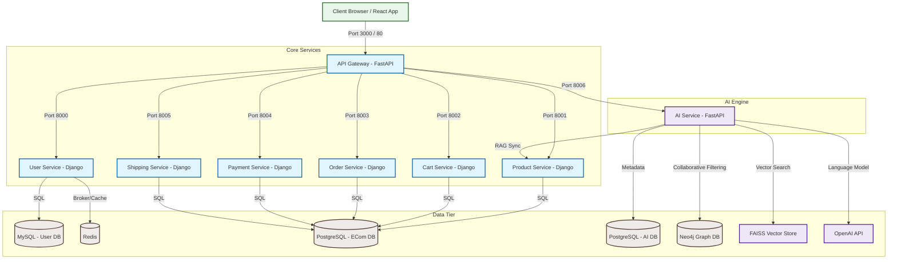

# 🛒 AI-Powered E-Commerce Microservices

A modern, containerized e-commerce platform built with a microservices architecture, featuring a custom API Gateway, dedicated services for core features, and an AI intelligence engine for personalized recommendations and a RAG-based chatbot.

---

## 🏗️ System Architecture

The platform consists of seven distinct services orchestrating with one another through a custom API Gateway, storing data across multiple database engines (SQL, NoSQL/Graph, Vectors).



---

## 🌟 Key Features

### 🛒 E-Commerce Operations
- **User Service:** User authentication (JWT-based), role management, profiles. Backed by **MySQL** and **Redis/Celery** for background operations.
- **Product Catalog:** Category-grouped product lists, price details, description search. Seeding support built-in. Backed by **PostgreSQL**.
- **Shopping Cart:** Manage user shopping baskets, item updates, checkout initialization. Backed by **PostgreSQL**.
- **Ordering & Checkout:** Process orders, track items, compute taxes/discounts. Backed by **PostgreSQL**.
- **Payment & Shipping Mockups:** Handles payment transactions simulation and tracks shipping status. Backed by **PostgreSQL**.

### 🤖 AI Capabilities
- **Next-Product recommendation (LSTM):** PyTorch sequence prediction model trained on user behavior to suggest the next likely purchase.
- **Collaborative Filtering Graph (Neo4j):** Connects users, products, and behavior (clicks, views, purchases) to form graph-based collaborative suggestions.
- **RAG-based Chatbot (FAISS + SentenceTransformers + OpenAI):** A conversational product assistant that answers queries using a local vector index built dynamically from your product catalog.
- **Score Fusion (Hybrid Recommendations):** Combines collaborative filtering, sequence predictions, and semantic search scores to provide state-of-the-art results.

---

## 🛠️ Tech Stack & Directory Structure

```
.
├── ai-service/          # FastAPI, PyTorch (LSTM), Neo4j, FAISS, SentenceTransformers
├── cart-service/        # Django REST Framework, PostgreSQL
├── ecom-frontend/       # React (Vite, TypeScript, TailwindCSS)
├── gateway/             # FastAPI custom reverse-proxy API Gateway
├── order-service/       # Django REST Framework, PostgreSQL
├── payment-service/     # Django REST Framework, PostgreSQL
├── product-service/     # Django REST Framework, PostgreSQL
├── shipping-service/    # Django REST Framework, PostgreSQL
├── user-service/        # Django REST Framework, MySQL, Redis
├── docker-compose.yml   # Multi-container service orchestrator
└── .gitignore           # Global git ignore rules
```

---

## 🚀 Quick Start

### 📋 Prerequisites
Ensure you have the following installed on your machine:
- [Docker & Docker Compose](https://docs.docker.com/get-docker/)
- [Git](https://git-scm.com/)

### ⚙️ Step 1: Configuration
Copy the `.env.example` file to `.env` in the root directory:
```bash
cp .env.example .env
```
Open `.env` and fill in the required passwords, database users, and optional keys (e.g., `OPENAI_API_KEY` if you wish to run LLM-powered chatbot options).

### 🐳 Step 2: Spin Up Containers
Run the Docker Compose suite:
```bash
docker-compose up --build
```
This command compiles and launches all services, databases, and migrations automatically:
- Starts MySQL, PostgreSQL, PostgreSQL-AI, Neo4j, and Redis databases.
- Performs automated database migrations for all Django microservices.
- Seeds base categories for the product service.
- Spins up the React frontend, API gateway, and AI service.

---

## 🌐 Port Mapping & Endpoint Reference

Once everything is running, access the services using the following ports:

| Service | Port (Host) | Internal Port | Description |
| :--- | :--- | :--- | :--- |
| **Frontend UI** | `http://localhost:3000` | `3000` | E-commerce user interface |
| **API Gateway** | `http://localhost:80` | `8080` | Entry point for all microservice APIs |
| **AI Service** | `http://localhost:8006` | `8006` | Standalone AI endpoints & OpenAPI docs |
| **Neo4j Console**| `http://localhost:7474` | `7474` | Database browser console for graph queries |
| **PostgreSQL (AI)**| `localhost:5433` | `5432` | Postgres database dedicated for AI store |
| **Redis Broker** | `localhost:6379` | `6379` | Cache / Celery message queue broker |

### 🔗 API Routes through Gateway (Port 80)
- **User Authentication:** `http://localhost/api/v1/auth/`
- **Product Catalog:** `http://localhost/api/v1/products/`
- **Cart Management:** `http://localhost/api/v1/cart/`
- **Order Tracking:** `http://localhost/api/v1/orders/`
- **Payments Processing:** `http://localhost/api/v1/payments/`
- **Shipping Logistics:** `http://localhost/api/v1/shipping/`
- **AI Recommendation Engine:** `http://localhost/api/v1/recommend/`
- **AI Chatbot Service:** `http://localhost/api/v1/chatbot/`

---

## 🧠 AI Engine Administration

The AI Service exposes management endpoints under `/api/v1/admin/` to keep its models and database stores up-to-date:

1. **Rebuild Product Vector Index:**
   ```bash
   curl -X POST http://localhost:8006/api/v1/admin/build-index
   ```
   *Fetches updated records from the Product Catalog and regenerates the FAISS index files.*

2. **Train LSTM Recommendation Model:**
   ```bash
   curl -X POST http://localhost:8006/api/v1/admin/train-lstm
   ```
   *Pulls user purchase/interaction logs from the user database and runs PyTorch training in a background thread.*

3. **Check AI Engine Health Status:**
   ```bash
   curl -X GET http://localhost:8006/health
   ```
   *Returns the load status of LSTM, Neo4j, and FAISS vector modules.*
